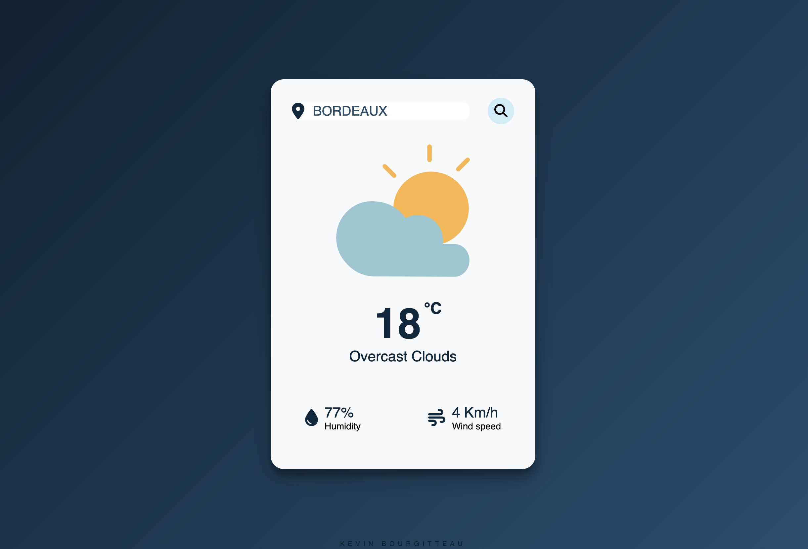

# Weather app - 

Application providing real-time weather of a given location, powered by the Open Weather API.

---

## 🛠 Tech Stack

**Client:**

**Server:**

**Other:**

---

## 💡 Features

---

## 💻 Softwares used

---

## 📲 Deployment

---

## 🎨 Color Reference

| Color      | Hex                                                                |
| ---------- | ------------------------------------------------------------------ |
| Dark blue  |  `#0A2133` |
| Metal blue  |  `#234D70` |
| Light blue |  `#CBECf9` |
| Silver     |  `#F8FAFC` |

---

## 📸 Screenshots

--- 

## 🔗 Links

